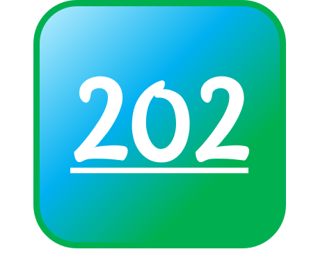
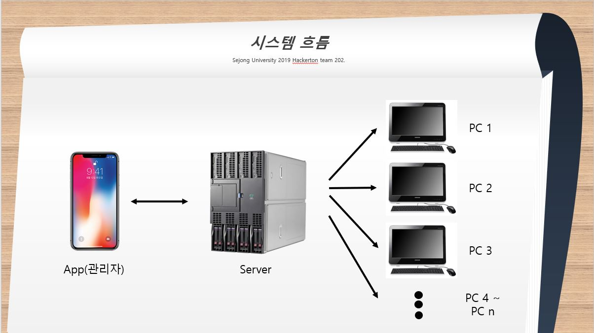

# Class-Electronic-Management-Application
### 2019. 06. 25 세종대학교 제 6회 SW 인공지능 해커톤 [금상]

 ``← 시연영상``
#### Team : 202[Accepted] → 요청은 수신하였지만 정의되지 않은 응답 + 대양 AI 센터 B202 조교들
##### 즉, 강의실들의 문제는 알고있지만 해결되지 않은 문제를 해결하고자 결성된 팀

### 1. 개요
 늦은 시간까지 켜져 있는 PC를 효율적으로 관리하기 위해서
 
### 2. 시스템 흐름

1. 조교 PC에 서버를 둔다. 
2. 각 강의실 PC에 시작프로그램으로 배치파일을 등록한다.
3. PC가 켜지면 자동으로 조교 PC 서버에 소켓으로 연결되도록 한다.
4. 안드로이드 어플리케이션으로 서버에 소켓 연결하여 현재 PC현황을 받는다.
5. 안드로이드 어플리케이션으로 각 PC를 관리한다.

### 3. 브랜치
[안드로이드](https://github.com/zojae031/Class-Electronic-Management-Application/tree/android)  
[서버](https://github.com/zojae031/Class-Electronic-Management-Application/tree/server)  
[클라이언트](https://github.com/zojae031/Class-Electronic-Management-Application/tree/client)  
